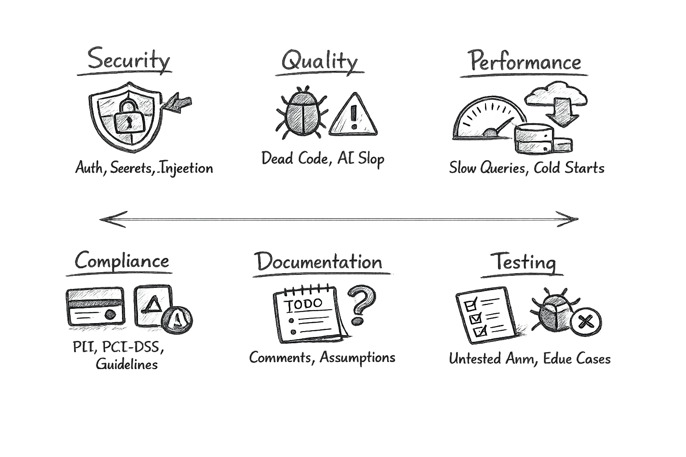

# 🛡️ Vibe Audit: Production-grade checks for AI-generated code

[](https://claude.ai/code)
[](https://owasp.org/Top10/)
[](https://www.pcisecuritystandards.org/)
[]()

> 🔍 Find security risks, scaling issues, and hidden bugs in AI-generated code before they hit production.

<picture>
  <source media="(prefers-color-scheme: dark)" srcset="vibe-audit-pillars.png">
  <source media="(prefers-color-scheme: light)" srcset="vibe-audit-pillars-light.png">
  
</picture>

A structured audit across the risks that actually break products:

- 🔐 **Security** — auth flaws, exposed secrets, injection risks
- ✅ **Quality** — dead code, weak typing, AI anti-patterns
- ⚡ **Performance** — slow queries, cold starts, heavy bundles
- 📋 **Compliance** — Stripe, App Store, data access risks
- 🧪 **Testing** — missing coverage in critical flows

Built specifically for AI-generated code, not generic linting.

---

## 🎯 See exactly what's wrong and where

```
━━━━━━━━━━━━━━━━━━━━━━━━━━━  🔴 CRITICAL  ━━━━━━━━━━━━━━━━━━━━━━━━━━━

  [Security]  src/app/api/webhooks/stripe/route.ts:23
  Missing Stripe signature verification — any HTTP request can spoof a payment event
  Fix → const sig = headers.get('stripe-signature')
         await stripe.webhooks.constructEventAsync(body, sig, env.STRIPE_WEBHOOK_SECRET)

━━━━━━━━━━━━━━━━━━━━━━━━━━━━━━━━━━━━━━━━━━━━━━━━━━━━━━━━━━━━━━━━━━━━
```

- ✏️ Clear issue descriptions
- 🚦 Severity levels (critical, high, medium, low)
- 📍 Exact file and line references
- 🔧 Actionable fixes, not generic advice

**No vague suggestions. Only concrete problems you can fix.**


---

## 🚀 Quickstart

Run Vibe Audit in under a minute:

```bash
# Add the marketplace source
/plugin marketplace add Shankulkarni/claude-plugin-marketplace

# Install the plugin
/plugin install vibeaudit@shankulkarni

# Restart Claude Code to load the plugin
# Then run your first audit
/audit
```

### 💻 Commands

| Command | What It Does |
|---------|-------------|
| `/audit` | Full incremental audit — only re-audits changed files |
| `/audit:quick` | Bash grep scan, ~5s, no AI tokens. Results marked `[UNVERIFIED]` |
| `/audit:full` | Full re-audit of every file, bypasses cache |
| `/audit:security` | Security dimension only — faster and more focused |
| `/audit:report` | Write findings to `AUDIT_REPORT.md` |

---

## 🧰 Stacks supported

Audits the stacks AI tools generate most frequently:

<table>
  <tr>
    <td align="center"><br /><b>React</b></td>
    <td align="center"><br /><b>React Native</b></td>
    <td align="center"><br /><b>Next.js</b></td>
    <td align="center"><br /><b>TypeScript</b></td>
  </tr>
  <tr>
    <td align="center"><br /><b>Node.js</b></td>
    <td align="center"><br /><b>Supabase</b></td>
    <td align="center"><br /><b>Stripe</b></td>
    <td align="center"><br /><b>Vercel</b></td>
  </tr>
</table>

Skills load automatically based on your `package.json` — only what's relevant.

---

## 📚 Technical details

For architecture, caching layers, audit skills, and plugin internals:

- 🏗️ [Architecture & caching](docs/architecture.md)
- 🔎 [Audit skills reference](docs/skills.md)
- 📊 [Coverage & standards](docs/coverage.md)
